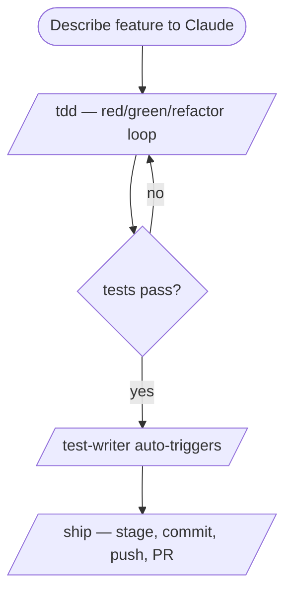
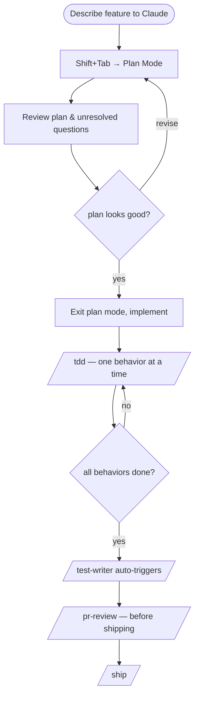
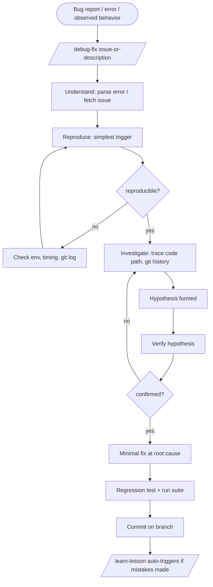
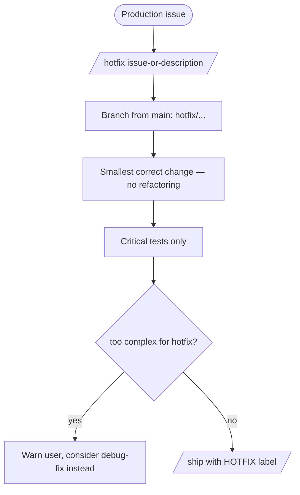

# Workflows

Common development patterns. Bold = you invoke it. Italic = auto-triggered.

## Commands at a Glance

| Command | Invoke | Triggers |
|---------|--------|----------|
| `/tdd` | Manual | — |
| `/debug-fix` | Manual | *`/learn-lesson`*, *`/git-version-control`* |
| `/ship` | Manual | *`/git-version-control`* |
| `/hotfix` | Manual | *`/git-version-control`* |
| `/pr-review` | Manual | *`@orchestrator`* → specialist agents |
| `/refactor` | Manual | — |
| `/explain` | Manual | — |
| `/setupdotclaude` | Manual (once) | — |
| `/test-writer` | Auto after new features | — |
| `/learn-lesson` | Auto after mistakes | — |
| `/git-version-control` | Auto by other skills | — |

## Agents at a Glance

| Agent | Invoke | Auto-delegated by |
|-------|--------|-------------------|
| `@orchestrator` | Manual or `/pr-review` | `/pr-review` |
| `@code-reviewer` | Manual or `@orchestrator` | `/pr-review` (always) |
| `@security-reviewer` | Manual or `@orchestrator` | `/pr-review` (security-related changes) |
| `@performance-reviewer` | Manual or `@orchestrator` | `/pr-review` (perf-sensitive changes) |
| `@doc-reviewer` | Manual or `@orchestrator` | `/pr-review` (docs changed) |
| `@frontend-designer` | Manual or `@orchestrator` | When building UI |

Agents run in **isolated context** — no conversation history, but full codebase access.

---

## Adding a Feature (Simple)

No planning needed — scope is clear, change is small.



---

## Adding a Feature (Complex)

Unclear scope, multiple files, or architectural impact.



---

## Debugging



---

## Hotfix (Production Emergency)



---

## Code Review

```mermaid
flowchart TD
    A([PR ready for review]) --> B[/pr-review PR-number/]
    B --> C[@orchestrator dispatches specialists]
    C --> D[@code-reviewer always runs]
    C --> E{security-related code?}
    C --> F{perf-sensitive code?}
    C --> G{docs changed?}
    E -- yes --> H[@security-reviewer]
    F -- yes --> I[@performance-reviewer]
    G -- yes --> J[@doc-reviewer]
    D & H & I & J --> K[Synthesized report: severity-ranked findings]
```

---

## Using Agents Directly

Invoke any agent by name in your prompt — no slash command needed.

```mermaid
flowchart LR
    A([You: @agent-name task]) --> B{agent type}
    B --> C[@code-reviewer\ncorrectness, logic, edge cases]
    B --> D[@security-reviewer\ninjection, auth, data exposure]
    B --> E[@performance-reviewer\nN+1, memory leaks, hot paths]
    B --> F[@doc-reviewer\naccuracy vs actual code]
    B --> G[@frontend-designer\ndistinctive UI, anti-AI-slop]
    B --> H[@orchestrator\nany multi-agent or complex task]
    C & D & E & F & G --> I([Isolated report, no conversation history])
    H --> J[Breaks into workstreams\ndispatches specialists in parallel]
    J --> I
```

**When to use `@orchestrator` directly**: any task benefiting from multiple specialists running in parallel (e.g. "review my entire auth system", "audit the billing module").

---

## Hooks (Automatic, No Command Needed)

Hooks run silently on tool events — no slash command required.

| Hook | When | What it does |
|------|------|-------------|
| `format-on-save.sh` | After any file edit | Auto-formats with Prettier / Black / Ruff / Biome / rustfmt / gofmt |
| `scan-secrets.sh` | Before file write | Blocks API keys, tokens, credentials from being written |
| `protect-files.sh` | Before edit to `settings.json` etc. | Prompts for confirmation; hard-blocks hook script edits |
| `warn-large-files.sh` | Before file write | Blocks writes to build artifacts and binaries |
| `block-dangerous-commands.sh` | Before bash commands | Blocks `push --force`, `reset --hard`, `DROP TABLE`, `rm -rf`, publish to main |
| `session-start.sh` | At session start | Injects branch / commit / stash / PR context into Claude's context |
